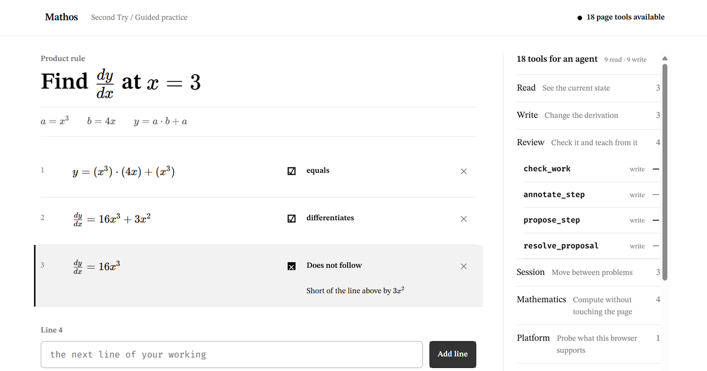

# Mathburst

> A photograph becomes a living mathematical world that a student and any WebMCP tutor can inhabit together.

Mathburst is an AI-native math whiteboard for tutoring. A problem can begin as a photograph and become editable equations, reactive graphs, dynamic geometry, matrices, diagrams, notes, and freehand work. The learner and the external tutor do not trade screenshots or disconnected chat messages: they act inside the same world.

**Live app:** [mathos-second-try.fireheartjerry.chatgpt.site](https://mathos-second-try.fireheartjerry.chatgpt.site)



## The 60-second judge path

1. Open the app. Press **Reconstruct photo**, then **AI double-check**, then **Approve clean conversion**. The photographed calculus becomes clean, selectable math.
2. Enter any attempted next step twice and press **Check step** after each. Press **Ask Tutor**. The tutor switches representation by creating a graph linked to the live equation instead of dumping an answer into chat.
3. Open **WebMCP · 18/18**. The inspector shows the exact page tools an external agent receives; every **Run** button invokes the same tool handler.
4. Press **2** for Olympiad Geometry. Drag point A or B and watch the dependent homothety and tangent circles recompute.
5. Press **3** for Matrix Space. Double-click the matrix, change a value, and commit it; the transformed grid and vectors update.
6. Press **Undo**. Human and tutor actions share one attributed, reversible history.

That is the whole thesis in one minute: the page owns the mathematical state and the agent gains precise control of it through WebMCP.

## Why this is different

Most AI tutoring is a chat beside a dead document. Mathburst makes the document alive.

- The whiteboard is independently useful: select, pan, zoom, draw, highlight, erase, type, typeset LaTeX, import an image, graph, construct geometry, transform matrices, create shapes/arrows/frames, group, layer, duplicate, align, reorder, undo, and redo.
- The tutor acts through the same typed world operations as the learner. There is no hidden agent-only scene model and no second mutation path.
- Agent work is visible. A tutor cursor moves to the target, affected objects reveal the commit, an activity rail records authorship, and global undo reverses it.
- Mathematics stays semantic. Graphs depend on equations, constructions depend on points, and matrices transform linked vectors.
- Reconstruction is the only approval gate. Ordinary tutor edits land directly, exactly like human edits, and remain attributed and undoable.

## Three mathematical worlds

**Calculus — the complete tutoring path.** A photographed integration-by-parts derivation is reconstructed into editable objects, audited against its source, and approved. Repeated symbolic difficulty triggers a linked graph and a diagnostic tutor question. Editing the source equation changes the visualization.

**Olympiad geometry — the frontier proof.** A declarative homothety and external-tangency construction recomputes from draggable points. It is a real live construction, not a flattened illustration.

**Linear algebra — the second frontier proof.** An editable 2×2 matrix transforms the coordinate plane and linked vectors in place.

## The complete WebMCP surface

Mathburst registers exactly eighteen discoverable page tools.

| Read the world | Direct action | Mathematical workflows |
| --- | --- | --- |
| `get_world` | `create_objects` | `reconstruct_problem` |
| `get_objects` | `update_objects` | `audit_reconstruction` |
| `get_selection` | `delete_objects` | `graph_expression` |
| `get_session_context` | `transform_objects` | `construct_geometry` |
| `get_history` | `apply_actions` | `visualize_concept` |
| `inspect_math` | `step_history` |  |
|  | `set_viewport` |  |

The surface is compact without being narrow. `create_objects`, `update_objects`, and `apply_actions` expose the full typed vocabulary for ink, text, images, shapes, arrows, equations, graphs, geometry, matrices, frames, and groups. The higher-level tools give agents clean golden paths for reconstruction and mathematical visualization.

Every tool returns a small success/failure envelope. Every mutation compiles into canonical operations, enters the same reducer as a human gesture, recomputes direct dependencies, records authorship, and becomes undoable.

### One registered tool, end to end

`get_selection` is the smallest complete example. Its definition supplies the required name, description, `inputSchema`, annotation, and execute callback:

```ts
const emptySchema = {
  type: 'object',
  properties: {},
  additionalProperties: false,
}

const getSelection = tool(
  'get_selection',
  'Read the current selection',
  'Read which objects the learner currently has selected.',
  emptySchema,
  true,
  (input) => {
    values(input, [])
    const world = bridge.getWorld()
    return {
      ok: true,
      summary: `${world.selection.length} objects selected`,
      data: {
        ids: world.selection,
        objects: world.selection.map((id) => world.objects[id]).filter(Boolean),
      },
    }
  },
)
```

The registry then passes that definition to the browser without replacing its handler:

```ts
document.modelContext.registerTool({
  name: tool.name,
  title: tool.title,
  description: tool.description,
  inputSchema: tool.inputSchema,
  annotations: tool.annotations,
  execute: (input) => tool.execute(input),
})
```

## Run locally

Requirements: Node.js 22.13+ and pnpm 11.

```bash
pnpm install
pnpm dev
```

Open [http://localhost:3000](http://localhost:3000). The whiteboard and its local tool inspector work in an ordinary browser; no API key, account, backend, or `.env` file is required.

For a static confidence check:

```bash
pnpm typecheck
pnpm build
```

There is intentionally no automated-test or CI/CD surface. This repository is a challenge-period hackathon build optimized for the deterministic demo path.

## Enable WebMCP

Use ChatGPT's WebMCP-capable browser, or in compatible Chrome builds enable:

```text
chrome://flags/#enable-webmcp-testing
```

Restart the browser, open Mathburst, and confirm the inspector reads **WebMCP · 18/18**. A manual browser check is also possible:

```js
const tools = await document.modelContext.getTools()
tools.map(({ name }) => name)
```

The inspector remains available when `document.modelContext` is absent, so the full interface can still be demonstrated locally.

## Scope, deliberately

This is an ambitious hackathon instrument, not a production SaaS application. It is one local document for one learner and one external tutor. There are no accounts, cloud sync, multiplayer servers, cross-session learner profiles, generalized OCR, or production infrastructure. Calculus is the polished end-to-end story; geometry and matrices are real, focused frontier scenes.

The project was built during the 2026 WebMCP Challenge submission period. The repository previously contained a different challenge-period prototype called **Second Try**; the final Mathburst pivot replaced its product model, interface, WebMCP surface, demo, and public story. The exact boundary is documented in [PROVENANCE.md](PROVENANCE.md), and Git history preserves the evolution.

## Stack and licence

React 19, TypeScript, Vinext/Next app router, SVG/HTML, KaTeX, CortexJS Compute Engine, browser `localStorage`, WebMCP, ChatGPT Sites, and Remotion for the demo video.

Licensed under the [MIT Licence](LICENSE).
