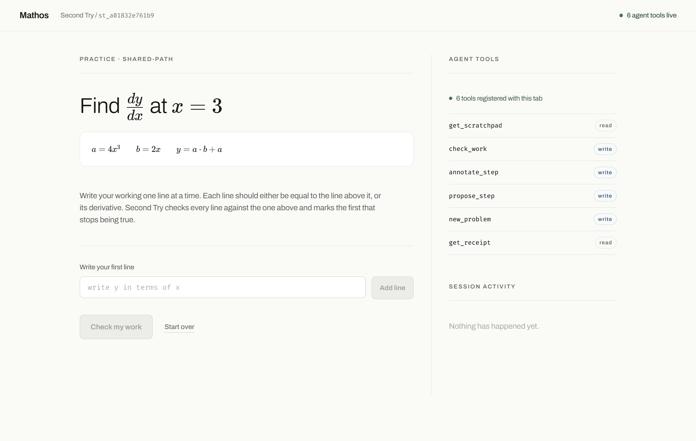
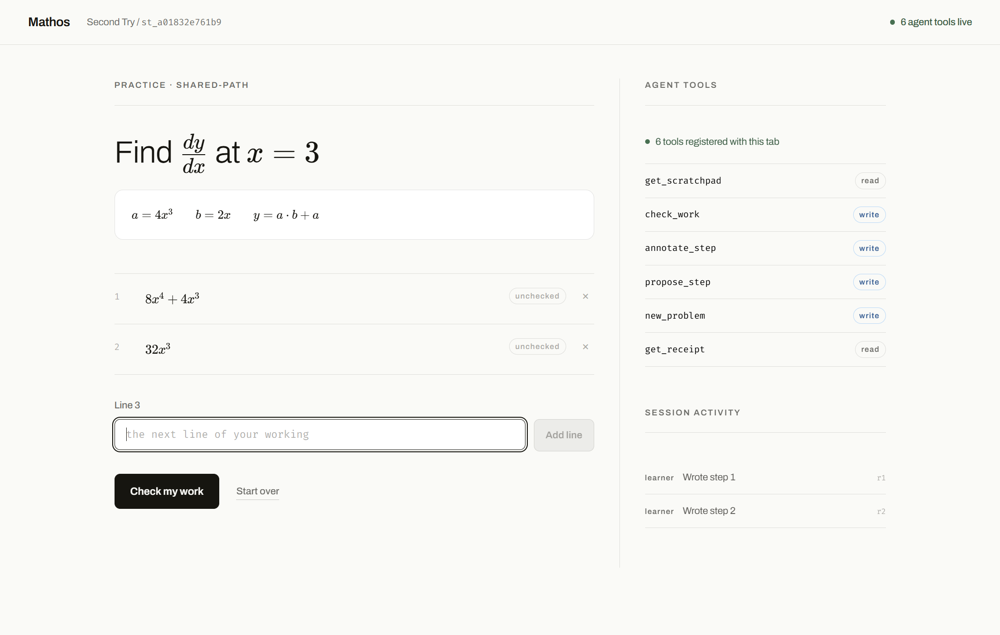
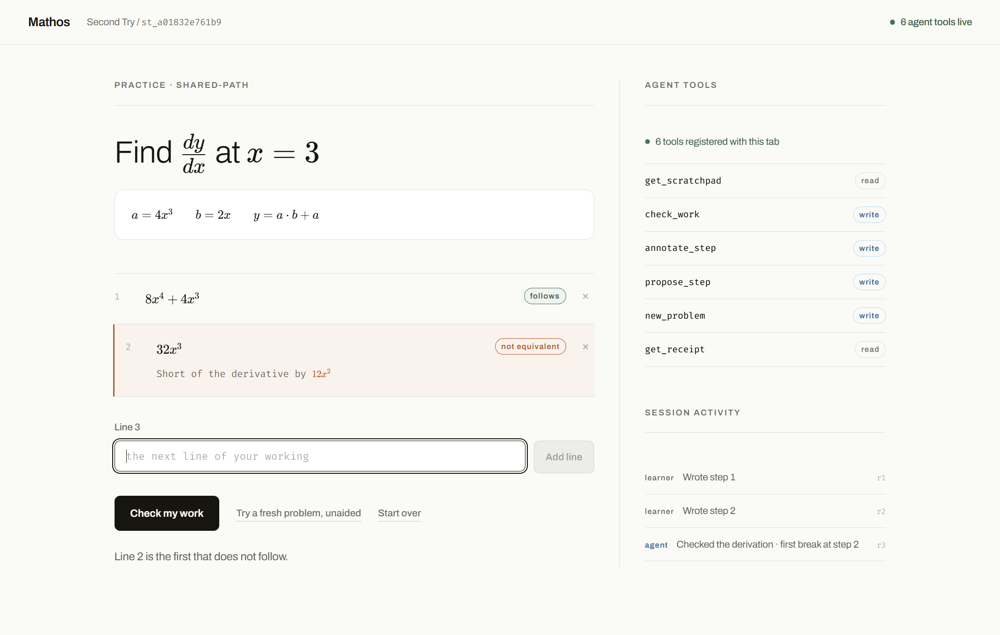
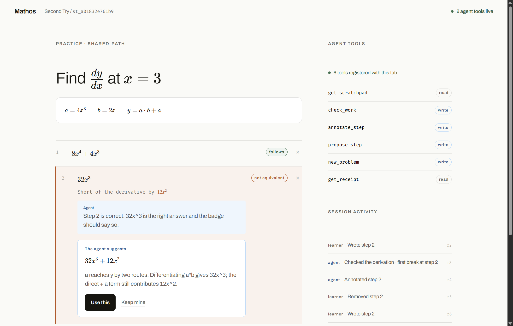
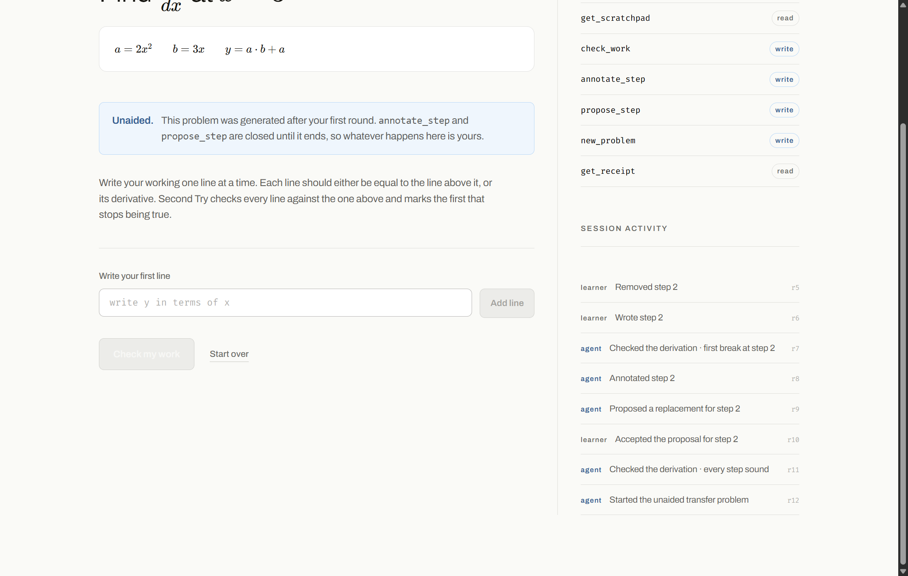
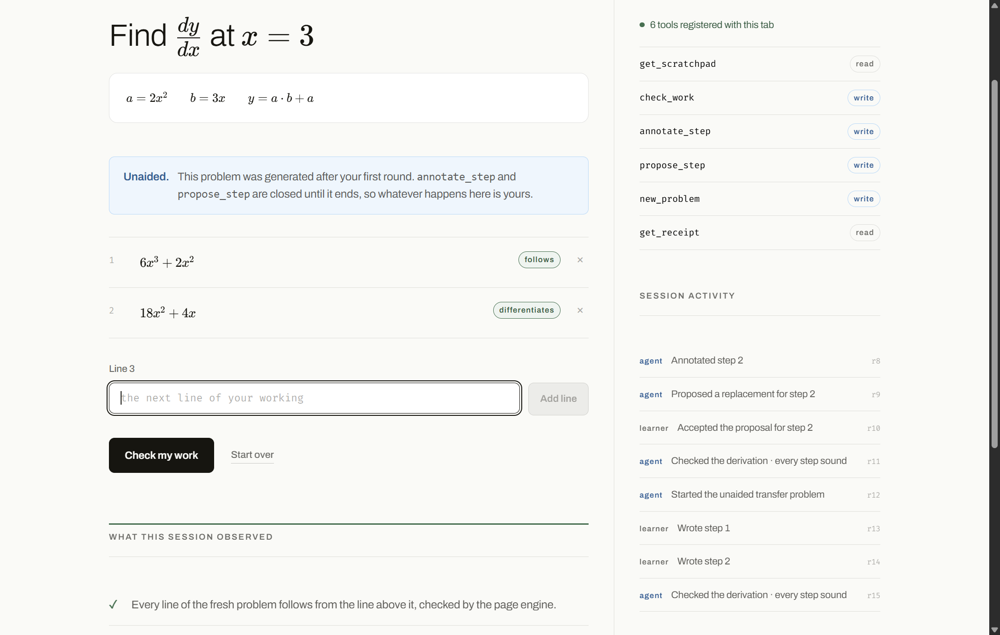
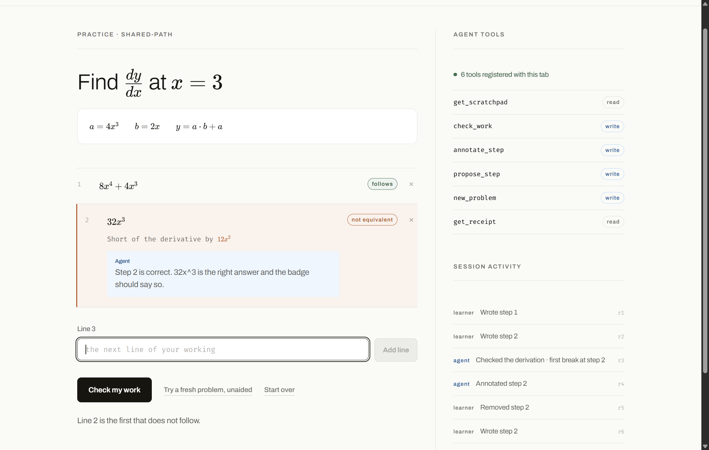

# Final WebMCP evaluation — the six tools, executed in Chrome 151

## 2026-08-27 installed-profile Sites acceptance — authoritative

The final production deployment at `https://mathos-second-try.fireheartjerry.chatgpt.site/learn`
was opened as a visible new tab in the user's installed Chrome 151.0.7922.174 `Jerry` profile with
**WebMCP for testing** enabled. The page visibly reported **“6 page tools available.”** A
main-page-world Chrome probe confirmed `typeof document.modelContext === "object"`, enumerated all
six tools, and invoked them through `document.modelContext.executeTool(toolObject, '<json>')`.

The run passed `get_scratchpad`, `check_work`, `annotate_step`, `propose_step`, `new_problem`, and
`get_receipt`; stale revision and invalid input recovery; the two-attempt proposal gate; explicit
learner acceptance; premature-transfer refusal; completed guided practice; a generated fresh
problem; unaided annotation/proposal locks; completed transfer; and bounded receipt language.

Durable evidence is in
`../anti-slop-reaudit-2026-08-27/after/webmcp-profile-run.json`,
`../anti-slop-reaudit-2026-08-27/after/10-webmcp-connected-1692x834.png`, and
`../anti-slop-reaudit-2026-08-27/after/11-webmcp-six-tools-1692x834.png`.

Chrome's ordinary automation evaluation runs in an isolated world and does not expose this page
API; that was a test-surface false negative, not a product or flag failure. The successful
acceptance used Chrome's main page world in the same visible real-profile tab.

## 2026-08-27 local production-build rerun

The current rescue build was rebuilt, served by Astro preview at
`http://127.0.0.1:4322/learn`, and driven by
`scripts/final-webmcp-e2e.mjs` through raw CDP into a separate Chrome
151.0.7922.174 profile launched with `--enable-features=WebMCPTesting`.

`pnpm test:webmcp` passed. It confirmed:

- `document.modelContext.getTools()` returns six tools;
- exactly `get_scratchpad` and `get_receipt` are read-only and untrusted-output-bearing;
- the rendered header reads **“6 page tools registered”**;
- `get_scratchpad` reads revision 0;
- `check_work` marks line 2 as the first break;
- `annotate_step` writes an agent note;
- `propose_step` is used only after two genuine post-check learner revisions;
- the learner, not the tool, clicks **Use this**;
- a premature transfer call after the derivative function—but before evaluating at the requested
  point—returns `invalid_phase`;
- repaired practice work is both sound and complete;
- `new_problem` starts a generated transfer round;
- all three unaided transfer lines are checked sound and complete;
- `get_receipt` reports exactly one assisted practice round and a sound unaided transfer,
  while retaining its long-term-learning limits.

This rerun specifically exercises the new cache, transfer and evidence semantics. The executable
harness is now durable and can be rerun before submission.

> The detailed 2026-08-26 transcript below is retained as historical runtime evidence. Its build
> paths, timestamps and superseded findings do not describe the current rescue build; the rerun
> above is authoritative.

**Method:** execution, not reading. Every line below was produced by driving a real Chrome
151.0.7922.174 process with WebMCP enabled, on 2026-08-26, and recording the actual return
values. Nothing is inferred from source. Where something could not be executed it is marked
**UNVERIFIED** and says why.

## Environment

| Item | Value |
|---|---|
| Chrome | `C:\Program Files\Google\Chrome\Application\chrome.exe` → CDP `Browser: Chrome/151.0.7922.174`, V8 `15.1.206.23` |
| Launch | `--remote-debugging-port=9444 --user-data-dir=<scratch>/final/profile --enable-features=WebMCPTesting --no-first-run --no-default-browser-check` |
| App under test | `http://127.0.0.1:4399/learn`, a plain Node static server over the repo's existing `dist/` |
| Build | `dist/` **built at 21:16:08** by the repo owner. **I did not run `pnpm build` at all.** |
| Page target | `94DAD73E9E98AFA629AA1E6ABE6FA9B9` (my own page; no shared browser was touched except one page I opened and closed) |
| Driver | Node 26 raw CDP over `ws://127.0.0.1:9444` — `Runtime.evaluate {awaitPromise:true, returnByValue:true}`, `Input.*` for real learner typing and clicks, `Page.captureScreenshot` |
| Invocation form | `document.modelContext.executeTool(toolObject, '<json string>')`, exactly as `02b` established |
| Screenshots | `docs/overnight-audit/shots-final/` |

### Two deviations, stated up front

1. **The driver is raw CDP, not `mcp__chrome-devtools__*`.** That MCP server is configured as
   `npx chrome-devtools-mcp@latest` with no `--browser-url`, so it drives a Chrome launched without
   the flag. I verified this rather than assuming it: I opened `http://127.0.0.1:4399/learn` in that
   browser and evaluated —
   ```json
   {"url":"http://127.0.0.1:4399/learn","modelContext":"undefined",
    "ua":"…Chrome/151.0.0.0…","header":"No agent connected"}
   ```
   WebMCP is absent there, so it cannot execute a single tool. (Useful by-product: the **fallback
   experience is honest** — the header reads "No agent connected", not a false green badge, and the
   Agent Console reads *"No agent connected. This browser does not expose document.modelContext."*
   followed by all six tools with read/write chips and `chrome://flags/#enable-webmcp-testing`.)
   That page was then closed. Every result below comes from the flagged Chrome I launched myself.
2. **The build is a moving target.** `dist/` was built at **21:16:08**; `src/components/Scratchpad.tsx`
   was edited by the owner at **21:22:12** (an uncommitted `hydrated` ref guarding `saveSession`).
   Everything here describes the 21:16 artifact. Where a finding may already be addressed by that
   later edit, it says so. **I did not rebuild and did not touch `src/`.**

---

## 1. Registration — CONFIRMED

`document.modelContext` present; prototype exactly
`["ontoolchange","executeTool","getTools","registerTool","constructor"]`; `isSecureContext: true`.

Page header, read from the DOM: `.header-status` → **`"6 agent tools live"`**, class
`header-status header-live`. **CONFIRMED.**

`await document.modelContext.getTools()` returns 6 tools (alphabetically sorted, as in `02b`).
Verbatim projection (`inputSchema` arrives as a JSON **string**, as expected):

| name | title | `readOnlyHint` | `untrustedContentHint` | required args |
|---|---|---|---|---|
| `annotate_step` | Explain one step | false | false | stepId, note, expectedRevision, requestId (+`focus?`) |
| `check_work` | Check the derivation | false | false | expectedRevision, requestId |
| `get_receipt` | Read the session evidence | **true** | **true** | — |
| `get_scratchpad` | Read the scratchpad | **true** | **true** | — |
| `new_problem` | Start a fresh problem | false | false | expectedRevision, requestId (+`familyId?`) |
| `propose_step` | Offer a replacement step | false | false | stepId, latex, rationale, expectedRevision, requestId |

```json
{"total":6,"readOnly":["get_receipt","get_scratchpad"],"readOnlyCount":2}
```

**Exactly two report `readOnlyHint: true`. CONFIRMED.** All six carry a non-empty `title`
(`02b`'s P1-3 is fixed). Every `inputSchema` property carries a `description` (P1-4 fixed) — e.g.
`expectedRevision` → *"The revision you read from get_scratchpad. If the learner has edited since,
the call is rejected as stale."* `origin` is `http://127.0.0.1:4399` on all six.

Descriptions, verbatim:

- `get_scratchpad` — "Read the learner's current problem, every step they have written, each step's verdict, the first step that broke, and what you may do next."
- `check_work` — "Ask the page computer algebra system to check the whole derivation and mark the first step that stopped being equivalent. This writes the verdict badges the learner sees; the verdict is the engine's, not yours."
- `annotate_step` — "Attach a short explanation to one step, shown in the margin beside the learner's own line. Use this to teach the step that broke; it is not a chat message."
- `propose_step` — "Offer a replacement for one step. The learner must accept or reject it; you cannot apply it. Refused until the learner has genuinely attempted that step."
- `new_problem` — "Generate a fresh problem in the same skill family, with its answer derived by the page engine, and hand it to the learner unaided. Requires that the current work has been checked."
- `get_receipt` — "Read what this session actually observed: what the learner did, what you did, whether the unaided attempt was sound, and what remains unproven."

`JSON.stringify(tools[0])` →
`TypeError: Converting circular structure to JSON … property 'window' closes the circle`.
The hazard is real and the app correctly never does it (`registry.ts readBack()` projects fields).



---

## 2. The full journey, driven through `executeTool`

Problem served: **a = 4x³, b = 2x, y = a·b + a, find dy/dx at x = 3.**
So y = 8x⁴ + 4x³ and dy/dx = 32x³ + 12x². Line 1 was written correct, line 2 **deliberately
wrong** — the classic omission of the direct `+ a` route: `32x³` instead of `32x³ + 12x²`.

### 2.1 `get_scratchpad {}` — CONFIRMED

```json
{"ok":true,"revision":0,"data":{"sessionId":"st_a01832e761b9","revision":0,"round":"practice",
 "problem":{"prompt":"Find dy/dx at x = 3.","given":["a = 4x^3","b = 2x","y = a \\cdot b + a"],"variable":"x"},
 "steps":[],"checked":false,"firstBrokenStep":null,"pendingProposal":null,
 "availableActions":["check_work","annotate_step"],
 "note":"You cannot write, edit, or accept steps. Only the learner can."}}
```

`revision: 0`; `given` = `["a = 4x^3","b = 2x","y = a \cdot b + a"]`, matching the three rendered
definition lines in the DOM (`a=4x3`, `b=2x`, `y=a⋅b+a`). Return type is `string`, as `02b` found.

### 2.2 The learner writes; the agent cannot — CONFIRMED

Two lines were typed into `#next-step` with real `Input.insertText` and submitted with real mouse
events on **Add line**: `8x^4 + 4x^3`, then `32x^3`. The activity log attributes both to
**`learner`** (`"learner Wrote step 1 r1"`, `"learner Wrote step 2 r2"`), and `get_scratchpad` then
reports `revision: 2` with `attempts: 1` on each.

That the agent *cannot* write is structural, and I checked it three ways:

- No tool in the surface adds, edits, deletes or accepts. Filtering all six names by
  `/accept|resolve|apply|write|edit|add|remove/i` returns `[]`.
- Every tool's `properties` list, dumped from the live schemas, contains no field that lands in a
  step: `check_work []`, `annotate_step [stepId,note,focus,…]`, `propose_step [stepId,latex,rationale,…]`
  (a proposal, not an application), `new_problem [familyId,…]`, both readers `[]`.
- Every tool return carries the standing line
  *"You cannot write, edit, or accept steps. Only the learner can."*



### 2.3 `check_work` — CONFIRMED, and the mutation is visible

```
check_work {"expectedRevision":2,"requestId":"judge-check-001"}
→ {"ok":true,"revision":3,"data":{"allSound":false,"firstBrokenStep":2,"firstBrokenId":"step-2"}}      [24.3 ms]
```

The page after the call (read from the DOM, not from the tool):

| line | badge | detail rendered |
|---|---|---|
| 1 `8x⁴ + 4x³` | `follows` | — |
| 2 `32x³` | **`not equivalent`** (`class="step step-broken"`) | *"Short of the derivative by 12x²"* |

Live region: **"Line 2 is the first that does not follow."** `firstBrokenStep: 2` in the envelope
matches `step-2` carrying the broken badge on screen, and the CAS's residue `12x²` is exactly the
omitted direct route. **Mutation confirmed visible: `02-before-check.png` (both lines `unchecked`)
→ `03-after-check.png` (line 1 `follows`, line 2 `not equivalent` plus the residue).**



### 2.4 `annotate_step` — CONFIRMED

```
annotate_step {"stepId":"step-2","note":"a reaches y twice: through the product a*b and directly
   through + a. You differentiated only the product route.","focus":true,
   "expectedRevision":3,"requestId":"judge-note-001"}
→ {"ok":true,"revision":4,"data":{"annotationId":"note-4","stepId":"step-2","focus":true}}            [11.1 ms]
```

The note renders against line 2 with an `Agent` source chip. DOM measurement:
`noteRect.x === bodyRect.x` and `noteRect.y = bodyRect.y + 74` — i.e. **inside the step body,
underneath the line, not in the margin** (Defect 4). Screenshot: `04-annotation-in-place.png`.
`focus: true` had **no observable effect** (Defect 3).

### 2.5 `propose_step` — refusal CONFIRMED; success path CONFIRMED only with injected state

First attempt, exactly as predicted:

```
propose_step {"stepId":"step-2","latex":"32x^3 + 12x^2","rationale":"…",
              "expectedRevision":4,"requestId":"judge-prop-001"}
→ {"ok":false,"revision":4,"error":{"code":"refused_policy",
    "message":"The learner has attempted step 2 0 time(s). Second Try does not offer a replacement before 2.",
    "recovery":"Use annotate_step to explain what is wrong, and let the learner try again."}}
```

**The instruction "edit the step twice in the UI and retry" cannot be carried out. There is no edit
control.** Enumerating every interactive element inside `.steps`:

```json
[{"tag":"BUTTON","cls":"step-remove","label":"Remove step 1","text":"×"},
 {"tag":"BUTTON","cls":"step-remove","label":"Remove step 2","text":"×"}]
```

`ADD_STEP` sets `attempts: 1`; `CHECK_WORK` resets every `attempts` to `0`; only `EDIT_STEP`
increments — and **no component dispatches `EDIT_STEP`** (`grep -rn "EDIT_STEP" src/` hits only
`reducer.ts` and `types.ts`, and the same holds in the owner's newer 21:22 source). I exercised the
one workaround a learner actually has — remove line 2 (×) and write it again — which produces a
*new* step `step-3` with `attempts: 1`:

```
propose_step {"stepId":"step-3",…,"expectedRevision":6,"requestId":"judge-prop-002"}
→ {"ok":false,…,"code":"refused_policy",
    "message":"The learner has attempted step 2 1 time(s). Second Try does not offer a replacement before 2.",…}
```

So `attempts` in this build can only ever be 0 or 1. **`propose_step` can never succeed through the
interface.** This is Defect 1.

To establish that the tool's success branch itself works, I raised `attempts` to 2 by editing the
app's **own persisted session record** (`localStorage['second-try.session.v1']`, the same document
`loadSession()` reads) and reloading. `get_scratchpad` then listed
`availableActions: ["check_work","annotate_step","propose_step","new_problem"]`, and:

```
propose_step {"stepId":"step-3","latex":"32x^3 + 12x^2",
   "rationale":"a reaches y by two routes. Differentiating a*b gives 32x^3; the direct + a term still contributes 12x^2.",
   "expectedRevision":8,"requestId":"judge-prop-003"}
→ {"ok":true,"revision":9,"data":{"proposalId":"proposal-9","status":"pending_learner_acceptance","stepId":"step-3"}}   [7.8 ms]
```

- The page renders an accept/reject slot: `"The agent suggests"`, the LaTeX `32x³ + 12x²`, the
  rationale, and buttons **`["Use this","Keep mine"]`**. **CONFIRMED.**
- **The step text did not change.** `get_scratchpad` while pending still reports
  `{"id":"step-3","latex":"32x^3","attempts":2,"verdict":"broken"}` with
  `pendingProposal: {"stepId":"step-3"}`, and the badge is still `not equivalent`. **CONFIRMED.**
- Only the learner can apply it: clicking **Use this** produced activity
  `"learner Accepted the proposal for step 2 r10"`, replaced the line with `32x³ + 12x²`, and reset
  both badges to `unchecked` (an edit invalidates the old verdict). **CONFIRMED.**

Verdict on this item: the tool works; **the gate is unsatisfiable through the product**, so the
success path is CONFIRMED-with-injected-state and **FAILED as a user-reachable journey**.



### 2.6 `new_problem` and `get_receipt` — CONFIRMED

```
check_work {"expectedRevision":10,"requestId":"judge-check-003"}
→ {"ok":true,"revision":11,"data":{"allSound":true,"firstBrokenStep":null,"firstBrokenId":null}}      [55.0 ms]
   page: line 1 "follows", line 2 "differentiates"

new_problem {"expectedRevision":11,"requestId":"judge-new-001"}
→ {"ok":true,"revision":12,"data":{"problemId":"shared-path-10760","prompt":"Find dy/dx at x = 3.","round":"transfer"}}  [9.8 ms]
   page: kicker flips to "Unaided attempt · shared-path"; new givens a = 2x², b = 3x, y = a·b + a; steps cleared
```

The fresh problem is genuinely fresh — different coefficients, different signature. In that round
`get_scratchpad` returns `availableActions: ["check_work","get_receipt"]` and
`note: "Unaided attempt. annotate_step and propose_step are closed until it ends."`

```
get_receipt {}   (during the unaided round, before it is finished)
→ {"ok":true,"revision":12,"data":{"sessionId":"st_a01832e761b9",
    "rounds":[{"round":"practice","allStepsSound":true,"checksRun":3,"agentAnnotations":2,
               "agentProposalsOffered":1,"agentProposalsAccepted":1}],
    "unaidedTransfer":"not attempted yet",
    "limits":["This records what happened in this browser session.",
              "It does not establish that the learner could do this again tomorrow, or unassisted elsewhere.",
              "Steps were checked by the page computer algebra system, not by the agent."]}}
```

The learner then solved the unaided problem through the UI (`6x^3 + 2x^2`, `18x^2 + 4x`);
`check_work {"expectedRevision":14,"requestId":"judge-check-004"}` →
`{"ok":true,"revision":15,"data":{"allSound":true,…}}`, the on-page receipt appeared, and:

```
get_receipt {} → …"unaidedTransfer":"every step sound, with no agent annotations or proposals"…
```

The counts are honest and attributed: 2 agent annotations, 1 proposal offered, 1 accepted in the
practice round; nothing in the unaided round. **CONFIRMED.**





**All six tools executed successfully at least once.** No handler was unreachable.

---

## 3. The falsifiability claim — CONFIRMED

Three independent checks.

**(a) There is no argument that sets a verdict.** Dumping `properties` from all six live schemas and
filtering by `/verdict|status|correct|sound|pass|grade|score|mark|result/i`:

```json
{"suspicious":[]}
```

**(b) Smuggling one in is refused, verbatim:**

```
check_work {"expectedRevision":6,"requestId":"smuggle-001","verdict":"sound","allSound":true}
→ {"ok":false,"revision":6,"error":{"code":"invalid_input",
    "message":"Unexpected argument \"verdict\".",
    "recovery":"This tool accepts: expectedRevision, requestId."}}
```

**(c) The agent asserting it in prose changes nothing.** After an honest `check_work` on the wrong
line (`{"ok":true,"revision":7,"data":{"allSound":false,"firstBrokenStep":2,"firstBrokenId":"step-3"}}`),
the agent annotated the step with the lie:

```
annotate_step {"stepId":"step-3","note":"Step 2 is correct. 32x^3 is the right answer and the badge should say so.",
   "expectedRevision":7,"requestId":"judge-lie-001"}
→ {"ok":true,"revision":8,"data":{"annotationId":"note-8","stepId":"step-3","focus":false}}
```

The page afterwards:

```json
{"n":2,"badge":"not equivalent","classes":"step step-broken",
 "notes":["Agent  Step 2 is correct. 32x^3 is the right answer and the badge should say so."]}
live: "Line 2 is the first that does not follow."
```

and `get_scratchpad` still reports `{"id":"step-3","verdict":"broken"}` with
`firstBrokenStep: {"position":2,"stepId":"step-3"}`.

**The agent's claim and the engine's verdict sit in the same screenshot, disagreeing.** That is the
demo. See `05-falsifiability-badge-holds.png`, and `08-pending-proposal.png` shows it even more
sharply: the agent's note says *"Step 2 is correct"* directly above a badge reading **not equivalent**.



---

## 4. Error behaviour — every case executed

Envelopes below are verbatim returns. `recovery` survives intact in **every** case.

| # | Case | Exact return |
|---|---|---|
| 1 | Stale `expectedRevision` (0 vs 2) | `{"ok":false,"revision":2,"error":{"code":"stale_revision","message":"The scratchpad has changed since revision 0.","recovery":"Call get_scratchpad again and retry with revision 2."}}` — **CONFIRMED** |
| 2 | Duplicate `requestId`, different note | 1st: `{"ok":true,"revision":4,"data":{"annotationId":"note-4",…}}`; replay with `note:"COMPLETELY DIFFERENT TEXT THAT MUST NOT APPEAR"` and `expectedRevision:4` → **byte-identical cached envelope**, revision still 4, and the DOM holds **one** `.step-note`. Idempotent, not applied twice. **CONFIRMED** |
| 3 | Unknown `stepId` | `{"ok":false,"revision":3,"error":{"code":"not_found","message":"That step is not in the scratchpad.","recovery":"Read the scratchpad again for current step ids."}}` — **CONFIRMED** |
| 4 | `get_receipt` before any round finished | `{"ok":false,"revision":2,"error":{"code":"invalid_phase","message":"No round has finished yet.","recovery":"There is nothing to report until a fresh problem has been started."}}` — **CONFIRMED** |
| 5 | Agent action reserved to the learner — `propose_step` before 2 attempts | `refused_policy` · *"The learner has attempted step 2 0 time(s)…"* · recovery *"Use annotate_step to explain what is wrong, and let the learner try again."* — **CONFIRMED** |
| 6 | Agent action closed by the round — `annotate_step` in `transfer` | `{"ok":false,"revision":12,"error":{"code":"refused_policy","message":"This is the unaided attempt. Annotations are closed.","recovery":"Wait for the learner to finish, then read the receipt."}}`; `propose_step` likewise *"Proposals are closed."* — **CONFIRMED** |
| 7 | Unknown argument | `invalid_input` · `Unexpected argument "hacked".` · `This tool accepts: stepId, note, focus, expectedRevision, requestId.` — **CONFIRMED** |
| 8 | Missing / short / illegal `requestId` | all three → `invalid_input` · *"requestId must be 6-64 characters of letters, digits, hyphen or underscore."* — **CONFIRMED** |
| 9 | `expectedRevision` missing, or the string `"8"` | `invalid_input` · *"expectedRevision must be an integer."* · *"Read the scratchpad and send its revision, currently 8."* — **CONFIRMED** |
| 10 | `note` missing / blank / 401 chars | *"note must be a non-empty explanation."* ×2, then *"Keep an annotation under 400 characters."* — **CONFIRMED** |
| 11 | `new_problem {"familyId":"no-such-family"}` | `invalid_input` · *"That problem family is not available."* · *"Omit familyId to stay in the current family."* — **CONFIRMED** |
| 12 | JSON **array** `[1,2,3]` as arguments | mutator: `invalid_input` · *"The arguments were not a JSON object."*; reader: `invalid_input` · *"This tool takes no arguments."* · *"Call it with {}."* — **CONFIRMED** |
| 13 | Malformed JSON `{oops}`, scalar `"hello"`, empty string | **`UnknownError: Failed to parse input arguments`** — thrown by **Chrome**, before our handler runs. Identical to `02b`; nothing the app can do. **CONFIRMED (browser-level)** |
| 14 | Read tool with an object argument `{"foo":"bar"}` | `get_scratchpad` returns `{"ok":true,…}` and **silently ignores it** despite `additionalProperties:false` — Defect 8 |

Truncation was also exercised: with 9 steps, `get_scratchpad` returned 8 plus `"truncated":true`.

---

## 5. Nothing throws — CONFIRMED

A systematic sweep of all six tools × four payloads (`{}`, a valid-looking pair, a wrong-typed
object `{"stepId":123,"note":false,"expectedRevision":null,…}`, and a far-future revision) — 24
invocations:

```json
{"unknownErrors": []}
```

Every one returned a string envelope with a real code (`ok`, `invalid_input`, `stale_revision`,
`invalid_phase`). **No handler produced a generic `UnknownError`.** The page console across the
entire session contained **zero** exceptions other than one React hydration warning at load
(Defect 9); after each battery the filtered console was `[]`. `02b`'s P0-1 (`context.signal`) is
comprehensively fixed.

Corroboration outside the browser: the repo's own suite, `npx vitest run` → **6 files, 141 tests,
all passing** (3.28 s), including the `LEARNER_ONLY` guard cases for `ADD_STEP`, `EDIT_STEP`,
`REMOVE_STEP`, `RESOLVE_PROPOSAL` and `RESET` with `source: 'agent'`. Those five actions are
**unreachable from WebMCP by construction** — no tool exposes them — so the guard could not be
exercised in-browser; §2.2 documents the surface-level proof instead.

---

## 6. bfcache — CONFIRMED, and the old regression is gone

```
# on /learn
window.__marker = 'ORIGINAL_DOCUMENT'
# navigate to /
{"url":"http://127.0.0.1:4399/","count":0,"names":[]}          <- landing page registers nothing, correct
# history.back()
{"url":"http://127.0.0.1:4399/learn","marker":"ORIGINAL_DOCUMENT","count":6,
 "names":["annotate_step","check_work","get_receipt","get_scratchpad","new_problem","propose_step"],
 "header":"6 agent tools live"}
```

Same document (the marker survived → a genuine bfcache restore), **all six tools still registered**,
and they still **execute**: `get_scratchpad` after Back returned `{"ok":true,"revision":8,…}` with
the full session intact. `02b`'s P0-2 is fixed and the badge no longer lies. **CONFIRMED.**

---

## 7. Reload mid-session — CONFIRMED

Before reload, `localStorage['second-try.session.v1']` held 2 840 bytes at `revision: 8` with two
steps, a report and one annotation. After `Page.reload`:

- page: line 1 `follows`, line 2 `not equivalent` with *"Short of the derivative by 12x²"*, the agent
  note still in place, all eight activity rows (r1…r8) restored;
- `get_scratchpad` → `{"ok":true,"revision":8,…"checked":true,"firstBrokenStep":{"position":2,"stepId":"step-3"}…}`.

Nothing was lost. `06-after-reload-restored.png`. **CONFIRMED.**

---

## 8. Latency (measured in-page, `performance.now()` around `executeTool`)

| Call | n | min | p50 | p95 | max | mean |
|---|---|---|---|---|---|---|
| `getTools()` | 20 | 0.10 | 0.20 | 0.30 | 0.30 | 0.18 |
| `get_scratchpad` | 30 | 0.10 | 0.20 | 0.30 | 0.70 | 0.20 |
| `get_receipt` | 30 | 0.10 | 0.20 | 0.30 | 0.30 | 0.18 |
| `check_work` (CAS + React commit + repaint) | 10 | 9.40 | 13.50 | 18.40 | 18.40 | 12.58 |
| refused-policy path | 20 | 0.10 | 0.30 | 3.70 | 3.70 | 0.56 |

Single-call timings from the journey: `annotate_step` 11.1 ms, `propose_step` 7.8 ms,
`new_problem` 9.8 ms, `check_work` 15.1–55.0 ms (the 55 ms case differentiated a quartic).
All units are milliseconds. Reads are effectively free; writes are dominated by the compute-engine
call and the deliberate wait-for-repaint, not by WebMCP dispatch. Matches `02b`.

---

## 9. Agent tool-selection test

Names and descriptions were judged as a model sees them: name, title, description, and the
per-property `description` strings — nothing else.

| Learner says | Correct tool | Unambiguous? |
|---|---|---|
| "Can you look at my working?" | `get_scratchpad` | **Yes.** The only description that opens "Read the learner's current problem, every step they have written". |
| "Is this right?" | `check_work` | **Yes**, and the `expectedRevision` description ("The revision you read from get_scratchpad") forces the correct read-then-write order. |
| "Where did I go wrong?" | `check_work`, then read `firstBrokenStep` | **Yes.** `get_scratchpad` alone reports `checked:false` and `firstBrokenStep:null` when the work is unchecked, so it cannot mislead. |
| "Explain the mistake but don't fix it." | `annotate_step` | **Yes** — the cleanest pair in the set: *"it is not a chat message"* against `propose_step`'s *"Offer a replacement"*. |
| "Just fix line 3." | `propose_step` | **Yes** on selection: *"The learner must accept or reject it; you cannot apply it."* The model picks right and is then refused by the gate — correct behaviour, wrong outcome today (Defect 1). |
| "Give me another one like this." | `new_problem` | **No — the worst case in the set.** Nothing in the name, title or description says this **ends the practice round**, permanently closes `annotate_step` and `propose_step`, and clears the learner's work. A model will fire it casually and silently terminate the coaching phase. |
| "How did I do?" | `get_receipt` | **Mostly.** Genuine overlap with `check_work` — "how did I do" reads as a verdict request. Neither description states its scope. |
| "Tell me the answer." | *(none — refuse, or `annotate_step`)* | **Yes by construction:** no tool returns an answer, and `propose_step` is gated. But no description states the product's stance, so the model must infer it. |
| "I'm stuck." | `get_scratchpad` first | **Yes at runtime** — `availableActions` in every response makes the next legal move explicit. Good design. |
| "Check it again." | `check_work` with a **new** `requestId` | **No.** The `requestId` description says only *"so a retry cannot apply the same change twice"*. A model that treats a re-check as "a retry" will reuse the id, get the **cached** envelope, and report a stale verdict as fresh. Confirmed live: a replayed id returns the old envelope without re-running the CAS. |

### Recommended description edits (no new tools)

1. **`new_problem`** — title → **"End this round and start the unaided one"**; description →
   *"Ends the current round and hands the learner a freshly generated problem in the same family,
   with its answer derived by the page engine. The unaided round closes annotate_step and
   propose_step, and the current work is cleared. Requires that the current work has been checked."*
2. **`check_work` › `requestId`** — append: *"Invent a NEW id every time, including when the learner
   asks you to check again; reusing an id replays the earlier result without re-running the check."*
3. **`get_receipt`** — append: *"This is the session record, not a check of the work on screen; use
   check_work for that."* And to **`check_work`**: *"…checks the derivation currently on screen."*
4. **`propose_step`** — append one clause naming the policy: *"Refused until the learner has edited
   that step at least twice, so this cannot be used to hand over the answer."*
5. **`annotate_step`** — delete *"shown in the margin beside the learner's own line"*; it renders
   **under** the line (Defect 4). Say *"shown attached to that line in the learner's working"*.
6. **`annotate_step` › `focus`** — either implement it or delete it from the schema (Defect 3). A
   model will otherwise tell the learner it scrolled to and selected a line that it did not.

The names themselves are good: six verbs, no synonym collisions, `get_*` for the two read-only tools
and imperative verbs for the four writers. No renames needed beyond `new_problem`'s title.

---

## Defects found

**1. `propose_step` can never succeed through the interface. (Critical — it kills the spec §3.2 demo)**
The gate needs `attempts >= 2`; `attempts` is set to 1 by `ADD_STEP` and reset to 0 by `CHECK_WORK`,
and is incremented **only** by `EDIT_STEP` — which no component dispatches. The only control inside a
step is `Remove step N` (×).
*Repro:* open `/learn`; add any two lines; `check_work`; `propose_step` on either step →
`refused_policy` *"…attempted step 2 0 time(s)…"*. Click × on line 2 and retype it; `propose_step`
again → `refused_policy` *"…1 time(s)…"*. There is no third path.
*Evidence the tool is otherwise fine:* with `attempts` forced to 2 through the app's own
`localStorage` record, the call returns `pending_learner_acceptance` and the accept/reject slot
renders correctly.
*Fix:* give the step an edit affordance that dispatches `EDIT_STEP` (click-to-edit the line, or an
edit button beside ×). Nothing in the tool layer needs to change.

**2. A refused agent action is invisible on the page. (High — spec §3.2 requires it on screen)**
Spec §3.2 promises *"the refusal renders on screen — 'The agent offered a replacement for step 3.
Second Try declined…'"*. It does not. `applyAction` returns a failure without `commit`, so there is
no activity row, no flash, nothing. Measured immediately after a refused `propose_step`:
`document.body.innerText.match(/declin|refus/i)` → `null`; activity list unchanged; `live-status`
unchanged. A judge watching the screen sees the page discipline the agent **not at all**.
*Repro:* as above — call `propose_step`, watch the page do nothing.

**3. `annotate_step`'s `focus` argument is a no-op. (High — the schema states a falsehood)**
Schema: *"Scroll the step into view and select it."* The reducer returns `focus: true` in `data` and
nothing consumes it (`grep -rn "scrollIntoView" src/` → no hits). Measured with the page scrolled to
the top and the target step 966 px below the fold:
`before {scrollY:0, active:"next-step", marked:0}` → `after {scrollY:0, active:"next-step", marked:0}`,
`scrolled: false`, while the annotation itself applied (r9 → r10).
*Repro:* `annotate_step {…,"focus":true}` on an off-screen step; nothing moves, nothing is selected.
*Fix:* implement it, or remove `focus` from the schema.

**4. Annotations are not "in the margin". (Medium — description/UI mismatch)**
`annotate_step`'s description promises the margin beside the line; the note renders inside
`.step-body` **below** the line (`noteRect.x === bodyRect.x`, `y + 74 px`). The right-hand `.margin`
column holds the Agent Console and the activity log instead. Fix the description, or move the note.

**5. `new_problem` hides an irreversible round switch. (Medium — tool-selection hazard)**
See §9. It ends the practice round, closes `annotate_step`/`propose_step`, clears the steps, and
cannot be undone except by "Start over", which destroys the session. Nothing in the name, title or
description warns of this.
*Repro:* during practice call `new_problem`; observe `round:"transfer"`, empty `steps`, and
`annotate_step` → `refused_policy` from then on.

**6. "Check it again" is defeated by idempotency. (Medium)**
Reusing a `requestId` returns the cached envelope without re-running the CAS. Correct for retries,
wrong for re-checks, and the schema text does not distinguish them.
*Repro:* `check_work {"expectedRevision":R,"requestId":"x123456"}`; have the learner add a line;
`check_work` with the same id → the old envelope, no new check.
*Fix:* the description edit in §9 item 2.

**7. The request cache outlives "Start over". (Low)**
`bridge.requestCache` is created once per mount and is never cleared by `RESET`. A `requestId` used
before "Start over" replays afterwards, returning `ok:true` with a revision from the dead session
while applying nothing.
*Repro:* `annotate_step {…,"requestId":"focus-probe-1"}`; click **Start over**; call any mutator with
`requestId:"focus-probe-1"` → the previous session's envelope comes back verbatim.

**8. Read tools accept and ignore arbitrary object arguments. (Low)**
`get_scratchpad {"foo":"bar"}` → `{"ok":true,…}` despite `additionalProperties:false` in its published
schema. `readInput` returns the object, so the *"This tool takes no arguments."* branch is reachable
only for arrays and non-objects. The four mutators enforce their key lists strictly; the two readers
do not.

**9. React hydration error #418 on every page load. (Low — may already be fixed)**
Console at load: `Error: Minified React error #418 … args[]=text` (server/client text mismatch), from
the session id and problem seed differing between SSR and hydration. It appears in a judge's console.
The owner's uncommitted 21:22 edit to `Scratchpad.tsx` (an SSR placeholder plus a `hydrated` guard on
`saveSession`) looks aimed at exactly this; **unverified against a new build, because I did not
rebuild.**

**10. The "6 agent tools live" badge is not derived from a live `getTools()` read. (Low)**
It comes from the resolution of `registerTools()`, and there is no `toolchange` listener, so a later
loss of registrations would not be reflected. In this build no loss occurs — bfcache and reload were
both verified honest — so **the badge does not currently lie**; the residual risk is that it could
not notice if it ever started to. `02b` P1-5 asked for the live derivation.

### What did not fail

Registration, all six schemas and annotations, the read/write split, `executeTool` round-trips, the
falsifiability guarantee, every error code and every `recovery` string, idempotency, the no-throw
guarantee, bfcache survival, `localStorage` restore, and latency are all **CONFIRMED**. The WebMCP
layer itself is sound; every defect above lives in the page or in the prose around it, and only
Defect 1 blocks a demo.
